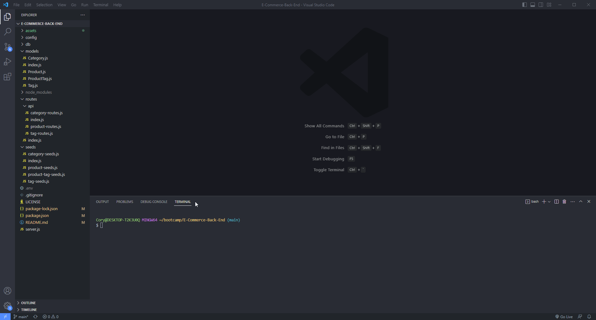
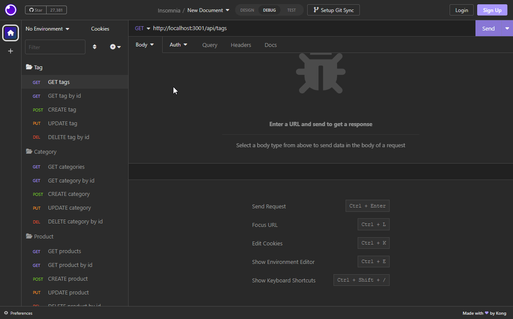
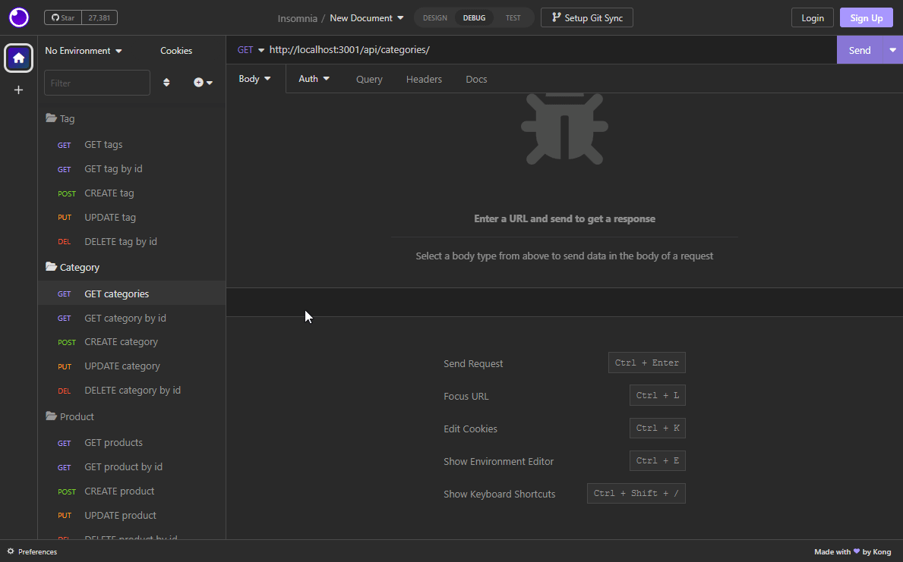
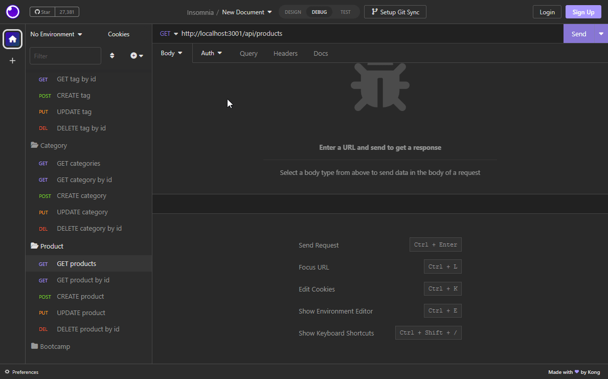

# E-Commerce-Back-End

## Created By
   - 
   - Cory 
   - @MacaroniKetchup
## Table of Contents
  - [Description](#description)
  - [Installations](#installations)
  - [Usage](#usage)
  - [Contact-Info](#contact)
  - [Contributions](#contributions)
  
* [License](#license)

## Description

This application is the back end server of an Ecommerce Website, where you as the user is able to SEARCH, CREATE, UPDATE, and DELETE Products in the inventory of your ecommerce shop. There is also functionality to even SEARCH, CREATE, UPDATE, and DELETE Categories as well as Tags that are listed in your inventory stock using this simple yet easy to use Ecommerce BAck End database!

## Installations

Instalations and dependancies that are needed for this application are listed as follows:

- Express.js
- Mysql2
- Sequelize
- Insomnia for testing

## Usage

How to use this application can follow along in the GIF files in the demo section of this READ ME. Each GIF will show each step on how to use this aplication from initilization of installs for the dependancies that are needed to run this application, as well as a step by step process of running GET, GET/:id, POST, UPDATE, and DELETE requests for each Product, Categories, and Tags requests to the back end server of the database

## Demo
- INSTALL AND START UP
- 

- "TAG" GET, GET/:id, POST, UPDATE, and DELETE requests
- 

- "CATEGORY" GET, GET/:id, POST, UPDATE, and DELETE requests
- 

- "PRODUCT" GET, GET/:id, POST, UPDATE, and DELETE requests
- 

## Contributors

N/A

## Contact-Info
- Name: Cory
- Email: stylesthestyer@gmail.com
- Github: [MacaroniKetchup](https://github.com/MacaroniKetchup/)

## License

      licensed under the MIT license.